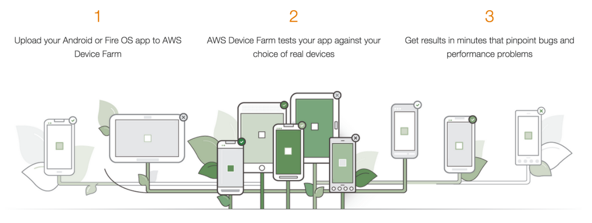
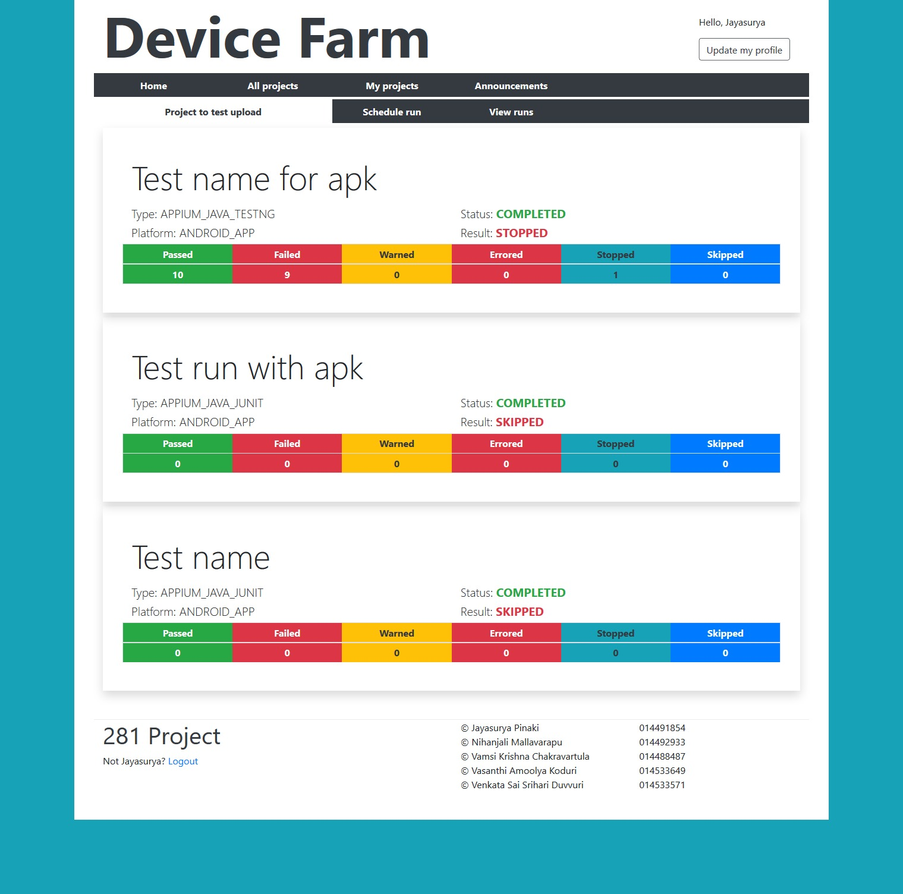

# MTaas Mobile Testing Over the Cloud

An application which is highly scalable system which implements Mobile Testing as a Service by using AWS Device Farm APIs. The system allows testing to be done on both iOS and Android platforms provided by AWS. Scalability is in terms of the number of mobile devices a project can be tested on. Also Automated selenium based testing over the cloud over an emulator 

Tech Stack: AWS Device Farm, Amazon S3, Appium Emulator/Simulator, React, Node, MongoDB
# Application

## Device Farm

## Application Page

## Manager/Tester Management

## Abstract

To build a MTaaS (Mobile Testing as a Service) system by providing a simple solution to users where managers and testers can work on projects together by sharing the required files and test reports. Testing can be done using various resources allocated and deallocated when required and a billing component will show the project managers about the cost associated with the resources that have been used in their projects.

## Architecture Diagram

## Architecture Diagram of Cloud

## Component Diagram

The various component interactions of the Application and the User Resource Management is as follows

